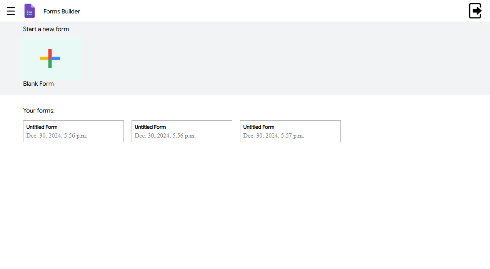

Here is a polished version of your content formatted for a `README.md` file:

```markdown
# Form Builder Application

## Setup Instructions

### 1. Clone the Repository
```sh
git clone https://github.com/your-username/your-forked-repo.git
cd your-forked-repo
```

### 2. Create and Activate a Virtual Environment
```sh
python -m venv venv
source venv/bin/activate  # On Windows use `venv\Scripts\activate`
```

### 3. Install Dependencies
```sh
pip install -r requirements.txt
```

### 4. Apply Migrations
```sh
python manage.py migrate
```

### 5. Run the Development Server
```sh
python manage.py runserver
```

---

## Usage Guide

### Creating a Form
1. Navigate to the home page.
2. Click on "Create a New Form."
3. Fill in the form details and add questions.
4. Save the form.

### Submitting Responses
1. Share the form link with respondents.
2. Respondents fill out the form and submit their responses.

### Viewing Responses
1. Navigate to the form's "Responses" section.
2. View individual responses.

### Customizing the Form
1. Use the "Customize Theme" option to change the form's appearance.
2. Set confirmation messages and other settings in the form's settings.

---

## Project Overview

The Form Builder Application allows users to create and manage forms effortlessly with features like:
- Customizable input fields: text, checkboxes, and dropdowns.
- Anonymous response submission.
- Response viewing and CSV export options.

Despite the core functionalities being implemented, an issue exists where only the heading is visible while content is not rendering properly. This may be due to:
- Improper HTML structure.
- CSS properties like `display: none;` or `visibility: hidden;`.
- JavaScript errors in dynamic content rendering.

I plan to resolve these issues in future iterations.

---

## Assumptions
- **Form Fields and Data Types:** Includes common fields like text, checkboxes, and dropdowns.
- **User Authentication:** Not required for form creation or submission.
- **Error Handling:** Basic form validation and error handling implemented.

---

## Learning Experience

- **Django REST Framework (DRF):** Learned to create RESTful APIs, use serializers, and handle CRUD operations.
- **Form Validation and Error Handling:** Gained insights into Django's form validation mechanisms.

---

## Time Taken

The project was completed in **one day** with a focus on:
- Core functionalities like form creation, submission, and API integration.
- Basic styling and functionality.

Due to time constraints, advanced features like full error handling and detailed styling were omitted.

---

## Future Enhancements

1. **Advanced Form Customization:**  
   - Drag-and-drop functionality.  
   - Customizable field types.  
   - Dynamic field reordering.

2. **Form Analytics and Reporting:**  
   - Analytics and response visualizations.

3. **Testing and Performance Optimization:**  
   - Write unit tests for robust functionality.  
   - Optimize code for scalability.

---

## External Libraries
- [Django](https://www.djangoproject.com/) - BSD License.
- [Django REST Framework (DRF)](https://www.django-rest-framework.org/) - BSD License.

---


## Screenshots

``` 

